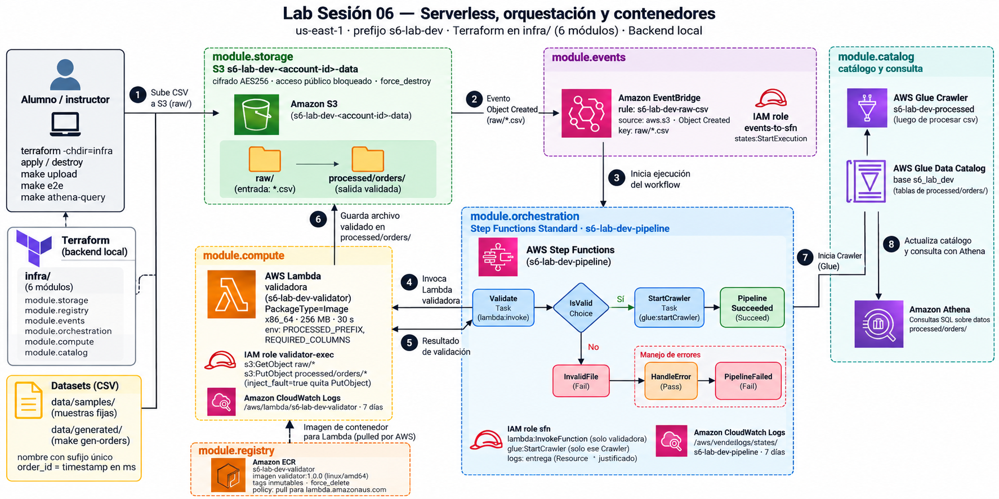

# Lab Sesión 06 — Serverless, orquestación y contenedores

Un pipeline de datos serverless en AWS, ya construido, que despliegas con Terraform y exploras para entender cómo interactúan los servicios. Subes un CSV a S3 y todo lo demás ocurre solo: EventBridge detecta el archivo, Step Functions orquesta, una Lambda empaquetada como imagen de contenedor lo valida, y Glue y Athena te dejan consultar el resultado con SQL.



*El mapa completo está en [docs/architecture/architecture.png](docs/architecture/architecture.png) (código fuente: [architecture.dot](docs/architecture/architecture.dot)).*

```text
S3 raw/*.csv -> EventBridge -> Step Functions -> Lambda (imagen en ECR) -> S3 processed/orders/
                                 y luego: StartCrawler -> Glue Crawler -> Data Catalog -> Athena
```

**Duración objetivo:** 45 minutos. **Región:** `us-east-1`.

## Qué hace la Lambda validadora

Es la única pieza de código propio del pipeline: una función Python (`src/lambdas/validator/app.py`) empaquetada como imagen de contenedor (x86_64, 256 MB, 30 s). **No la dispara S3 ni EventBridge directamente: la invoca Step Functions**, una vez por cada CSV nuevo en `raw/`. Su trabajo es decidir si el archivo es aceptable y, si lo es, dejar una copia limpia en `processed/orders/`.

**Paso a paso**

1. **Recibe el evento** de EventBridge (que Step Functions le pasa completo) y saca de él el bucket y la clave del archivo.
2. **Lee el objeto** de `raw/` en S3 y lo decodifica como UTF-8, descartando el BOM si lo trae (el BOM es un carácter invisible que algunos programas, como Excel, añaden al inicio y que ensucia el encabezado).
3. **Valida el contenido** con las reglas de abajo. La primera que falle decide el motivo del rechazo.
4. **Si es válido, escribe el archivo** en `processed/orders/` **con el mismo nombre**, ya normalizado (UTF-8, sin BOM). No transforma las filas: las copia tal cual.
5. **Devuelve el resultado** a Step Functions, que decide el siguiente paso.

**Reglas de validación** (en este orden)

| Regla | Motivo si falla (`reason`) |
|---|---|
| El contenido es UTF-8 válido | `invalid_encoding` |
| El nombre termina en `.csv` | `invalid_extension` |
| El archivo no está vacío | `empty_file` |
| Tiene las columnas `order_id`, `customer_id`, `amount` y `status` | `missing_columns: <las que faltan>` |
| Tiene al menos una fila de datos | `no_data_rows` |
| Todos los `amount` son números (no `abc`, `NaN` ni `1_000`) | `invalid_amount: row N` |

Solo comprueba la **forma** del archivo. No valida los valores de `order_id`, `customer_id` ni `status`, ni busca duplicados.

**Qué devuelve y qué pasa después**

| Resultado de la Lambda | Estado en Step Functions |
|---|---|
| `{"valid": true, "records": 10, "output": "processed/orders/orders_….csv"}` | `IsValid` → `StartCrawler` → `PipelineSucceeded` |
| `{"valid": false, "reason": "invalid_amount: row 1"}` | `IsValid` → `InvalidFile` (ejecución `FAILED`, sin archivo de salida) |
| Error inesperado (por ejemplo `AccessDenied` al escribir en S3) | Se propaga **a propósito**: Step Functions reintenta los errores de servicio de Lambda y, si persiste, lo captura en `$.error` → `HandleError` → `PipelineFailed` |

Un archivo inválido no es un error de la Lambda: ella responde con normalidad (`valid: false`) y es Step Functions quien lo marca como fallido. Un error técnico, en cambio, sí rompe la ejecución. Esa diferencia es la que se explora en el ejercicio de Troubleshoot.

**Propiedades que conviene conocer**

- **Idempotente:** la salida tiene el mismo nombre que la entrada, así que reprocesar un archivo sobrescribe su copia en `processed/` en lugar de duplicar filas.
- **Permisos mínimos:** su rol solo puede leer `raw/*` y escribir `processed/orders/*`. Con `inject_fault=true` Terraform le quita el permiso de escritura para provocar el fallo del ejercicio.
- **Configurable:** las variables de entorno `PROCESSED_PREFIX` (por defecto `processed/orders/`) y `REQUIRED_COLUMNS` cambian la carpeta de salida y las columnas exigidas, sin tocar el código.
- **Límite conocido:** lee el archivo completo en memoria; sirve para CSV pequeños (hasta decenas de MB). Para archivos de varios GB habría que procesar en streaming o usar Glue.
- **Fácil de probar:** la validación es una función pura (`validate_csv`), sin acceso a AWS, con tests locales en `tests/lambdas/test_validator.py` (`make test`).

## Qué vas a aprender

- Cómo un evento de S3 inicia un workflow sin código de pegamento (EventBridge → Step Functions).
- Cómo se empaqueta, publica y despliega una Lambda como **imagen de contenedor** (Docker + ECR).
- Reintentos y manejo de errores en Step Functions (`Retry`, `Catch`) y cómo diagnosticar un fallo de permisos.
- Cómo catalogar y consultar los resultados con Glue y Athena.
- Cómo se define todo esto como infraestructura en Terraform, organizada en módulos por servicio.

## Requisitos

| Necesitas    | Detalle                                                                                                                 |
| ------------ | ----------------------------------------------------------------------------------------------------------------------- |
| Terminal     | **Git Bash** (el Makefile usa `bash`)                                                                           |
| Herramientas | Git, GNU Make, Docker Desktop (con el daemon activo), AWS CLI v2, Terraform ≥ 1.6 y[`uv`](https://docs.astral.sh/uv/) |
| Cuenta AWS   | Credenciales con permisos para IAM, Lambda, ECR, S3, Step Functions, EventBridge, Glue, Athena y CloudWatch Logs        |

## 1. Clonar y preparar

```bash
git clone 
cd lab_6_serverless
uv sync                                  # crea .venv con las dependencias
```

Credenciales de AWS: copia la plantilla, completa tus valores (el archivo está ignorado por git, no se sube) y cárgalas en la terminal donde vayas a trabajar:

```bash
cp .env.example .env.credentials         # edítalo con tus claves
set -a; source .env.credentials; set +a
make preflight                           # docker, aws, terraform y tu cuenta
```

Si tus credenciales son temporales (llevan `AWS_SESSION_TOKEN`) caducan; cómo renovarlas está en [docs/deploy/guia_docker.md](docs/deploy/guia_docker.md#5-renovar-la-sesión). Si Terraform falla con `x509: certificate signed by unknown authority`, ejecuta `export TF_DISABLE_PLUGIN_TLS=1`.

## 2. Desplegar

Terraform se ejecuta directamente; el Makefile solo envuelve Docker, AWS CLI y los scripts. La Lambda se crea desde una imagen, así que esa imagen debe estar en ECR **antes** del `apply` completo:

```bash
terraform -chdir=infra init
terraform -chdir=infra apply -target=module.registry   # 1. solo el repositorio ECR
make image-publish TAG=1.0.0                           # 2. build + push de la imagen
terraform -chdir=infra apply                           # 3. el resto del stack
```

Detalle, tags y solución de problemas: [docs/deploy/guia_deploy.md](docs/deploy/guia_deploy.md).

## 3. Probar el pipeline

```bash
make gen-orders          # genera un CSV nuevo en data/generated/
make upload-generated    # lo sube a raw/: esto dispara el pipeline
make executions          # ¿terminó en SUCCEEDED?
make crawler-status      # el Crawler lo inicia Step Functions; espera a READY
make athena-query        # consulta el resultado con SQL
```

También puedes usar los archivos fijos de [data/samples/](data/samples/) (`make smoke` sube uno válido y uno inválido). `make e2e` ejecuta una verificación completa con el SDK de Python. Qué hace cada comando: [docs/lab/glosario_comandos.md](docs/lab/glosario_comandos.md).

## 4. Explorar y practicar

1. **Recorre el flujo en la consola de AWS**, servicio por servicio, con [docs/lab/demo_consola_aws.md](docs/lab/demo_consola_aws.md).
2. **Troubleshoot:** un instructor (o tú) rompe un permiso con `terraform -chdir=infra apply -var inject_fault=true`; sube un archivo, sigue la ruta EventBridge → Step Functions → Lambda, lee el error y corrígelo con `-var inject_fault=false`.
3. **Cambia el código de la Lambda:** necesita un tag de imagen **nuevo** (ECR es inmutable). Ver [docs/deploy/guia_docker.md](docs/deploy/guia_docker.md#4-tags-digest-e-inmutabilidad).

## 5. Cómo está organizado el repositorio

```text
README.md                 # esta guía
Makefile                  # atajos de Docker/ECR, AWS CLI y scripts (make help)
infra/                    # Terraform: main.tf + módulos por servicio
  modules/storage         #   bucket de datos (S3) con eventos a EventBridge
  modules/registry        #   repositorio ECR
  modules/compute         #   Lambda validadora + su rol y logs
  modules/orchestration   #   Step Functions (Retry, Catch, StartCrawler)
  modules/events          #   regla de EventBridge raw/*.csv
  modules/catalog         #   Glue (Crawler, base) y Athena
src/lambdas/validator/    # código de la Lambda (app.py)
src/contracts/            # contrato del dataset orders
docker/validator/         # Dockerfile de la imagen de la Lambda
data/samples/             # CSV de prueba (válidos, inválidos, casos límite)
data/generated/           # CSV de make gen-orders (se crea al usarlo; ignorado por git)
scripts/                  # generate_orders.py, check_deployed_pipeline.py (e2e), testing/
tests/                    # lambdas/ e infra/ (locales), aws/ (contra el stack)
docs/                     # ver abajo
```

### Por dónde empezar a leer

| Quiero...                                 | Voy a                                                                   |
| ----------------------------------------- | ----------------------------------------------------------------------- |
| Ver el mapa de servicios                  | [docs/architecture/architecture.png](docs/architecture/architecture.png) |
| Entender qué hace la Lambda               | [Qué hace la Lambda validadora](#qué-hace-la-lambda-validadora) y su código en [app.py](src/lambdas/validator/app.py) |
| Desplegar y destruir el stack             | [docs/deploy/guia_deploy.md](docs/deploy/guia_deploy.md)                 |
| Entender la imagen Docker, ECR y los tags | [docs/deploy/guia_docker.md](docs/deploy/guia_docker.md)                 |
| Recorrer el pipeline por la consola       | [docs/lab/demo_consola_aws.md](docs/lab/demo_consola_aws.md)             |
| Saber qué hace cada`make`              | [docs/lab/glosario_comandos.md](docs/lab/glosario_comandos.md)           |
| Ver por qué se diseñó así             | [docs/internal/adr/](docs/internal/adr/) y [docs/specs/](docs/specs/)     |
| Leer cómo se construyó                  | [docs/plans/](docs/plans/)                                               |

Para leer el código en orden: `src/lambdas/validator/app.py` (qué valida la Lambda) → `infra/modules/orchestration/pipeline.asl.json.tftpl` (el workflow) → `infra/main.tf` (cómo se conectan los módulos).

## 6. Tests

```bash
make test    # unitarios y de infraestructura, sin AWS
make lint    # estilo del código
make e2e     # contra el stack desplegado (usa tus credenciales)
```

## 7. Al terminar

El stack cuesta muy poco, pero no lo dejes encendido:

```bash
terraform -chdir=infra destroy     # escribe yes para confirmar
```

Elimina todo (buckets, repositorio ECR, Lambda, Crawler…) sin pasos manuales. Lo único que no borra son las imágenes locales de Docker y el log group compartido `/aws-glue/crawlers`.
